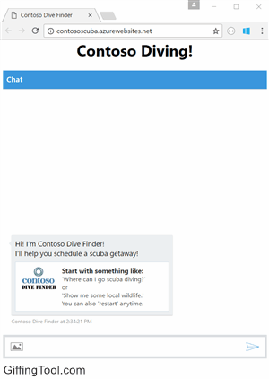

# Contoso Dive Finder

## Introduction 

Most chat bot platforms have a single input box through which users type messages in order to interact with a bot.  [**Adaptive Cards**](http://adaptivecards.io/) provide a new way to create custom and interactive cards, with rich visuals and controls, that adapt to the platform on which they are being displayed.  In order to demonstrate the richness of Adaptive Cards in this sample, we've created a bot for a fictitious company that provides a scuba diving search and reservation service.  **Contoso Dive Finder** demonstrates incorporating Adaptive Cards into a bot built using the [**Microsoft Bot Builder .NET SDK**](https://github.com/Microsoft/botbuilder-dotnet) and the [**Adaptive Cards nuget**](https://www.nuget.org/packages/AdaptiveCards) package.   



## Getting Started

A published example of the **Contoso Dive Finder** is: [ContosoScubaDemo.AzureWebsites.net](https://contososcubademo.azurewebsites.net/)  

If you desire to run the sample yourself: 

* Download the source
* Create a Bot Registration in the [Azure Portal](https://portal.azure.com) (Instructions can be found here: [Quickstart Guide](https://docs.microsoft.com/en-us/azure/bot-service/bot-service-quickstart-registration))
* Retrieve your bot's **Direct Line** channel secret from the direct line configuration page and add it to the **default.htm** page
* Add your bot's **MicrosoftAppId** and **MicrosoftAppPassword** to the appsettings.json 
* Publish your bot (make sure the messaging endpoint in bot settings is set to the published url: https://sitename.azurewebsites.net/api/messages)

## Creating Adaptive Cards

Adaptive Cards not only visually conform to the layout and style of the platform they are displayed on, they are also easy for developers to work with.  Microsoft has engineered the library to be flexible, extendable, and to provide developers with multiple methods for construction and manipulation.  In this sample, we've chosen to load .json files containing Messages with nested cards.

## Some Code

Loading a card is as simple as reading the .json file, and creating a reply with its contents:

```cs

 public static async Task<string> GetCardText(string cardName)
{
    return await File.ReadAllTextAsync($@".\Cards/{cardName}.JSON");
} 

```

The **ScubaCardService** source code is not shown here.  It is responsible for loading the card providers via reflection, and calling each of them to determine which one is responsible for handling the incoming message activity.  Shown here is the **GetNextScubaMessage** method, and **GetCardReply**, in the **RootDialog**.  This code turns the adaptive card into a message that is sent back to the user.
 
```cs


private async Task<IMessageActivity> GetNextScubaMessage(ITurnContext context, Activity activity)
{
    var resultInfo = await new ScubaCardService().GetNextCardText(context, activity);
    if (!string.IsNullOrEmpty(resultInfo.ErrorMessage))
        return activity.CreateReply(resultInfo.ErrorMessage);

    return GetCardReply(activity, resultInfo.CardText);
}

public static Activity GetCardReply(Activity activity, string cardText)
{
    var reply = JsonConvert.DeserializeObject<Activity>(cardText);
    if (reply.Attachments == null)
        reply.Attachments = new List<Attachment>();

    var tempReply = activity.CreateReply("");
    reply.ChannelId = tempReply.ChannelId;
    reply.Timestamp = tempReply.Timestamp;
    reply.From = tempReply.From;
    reply.Conversation = tempReply.Conversation;
    reply.Recipient = tempReply.Recipient;
    reply.Id = tempReply.Id;
    reply.ReplyToId = tempReply.ReplyToId;
    if (reply.Type == null)
        reply.Type = ActivityTypes.Message;

    return reply;
}

```

## Welcome Card

With columns, image support, text manipulation properties and more: Adaptive Cards are powerful and fun to use!

```json

{
  "type": "message",
  "text": "Hi! I'm Contoso Dive Finder!\n\nI'll help you schedule a scuba getaway!",
  "attachments": [
    {
      "contentType": "application/vnd.microsoft.card.adaptive",
      "content": {
        "type": "AdaptiveCard",
        "body": [
          {
            "type": "ColumnSet",
            "columns": [
              {
                "type": "Column",
                "size": "auto",
                "items": [
                  {
                    "type": "Image",
                    "size": "medium",
                    "url": "http://contososcuba.azurewebsites.net/assets/Contoso_logo.jpg"
                  }
                ]
              },
              {
                "type": "Column",
                "items": [
                  {
                    "type": "TextBlock",
                    "text": "Start with something like:",
                    "size": "large",
                    "weight": "bolder"
                  },
                  {
                    "type": "TextBlock",
                    "text": "'Where can I go scuba diving?'",
                    "separation": "none"
                  },
                  {
                    "type": "TextBlock",
                    "text": "or",
                    "separation": "none"
                  },
                  {
                    "type": "TextBlock",
                    "text": "'Show me some local wildlife.'",
                    "separation": "none"
                  },
                  {
                    "type": "TextBlock",
                    "text": "You can also 'restart' anytime.",
                    "separation": "none"
                  }
                ]
              }
            ]
          }
        ]
      }
    }
  ]
}

```

## More Information

- [AdaptiveCards.io](http://adaptivecards.io)
- [Open Source Repository](https://github.com/Microsoft/AdaptiveCards)